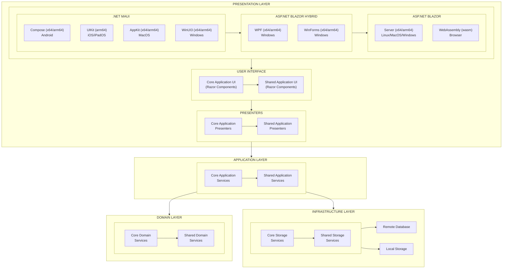

```mermaid
graph TD
MAUI_BLAZOR_HYBRID_COMPOSE["Compose (x64/arm64)</br>Android"]
MAUI_BLAZOR_HYBRID_UIKIT["UIKit (arm64)</br>iOS/iPadOS"]
MAUI_BLAZOR_HYBRID_APPKIT["AppKit (x64/arm64)</br>MacOS"]
MAUI_BLAZOR_HYBRID_WINUI["WinUI3 (x64/arm64)</br>Windows"]

BLAZOR_HYBRID_WPF["WPF (x64/arm64)</br>Windows"]
BLAZOR_HYBRID_WINFORMS["WinForms (x64/arm64)</br>Windows"]
BLAZOR_SERVER["Server (x64/arm64)</br>Linux/MacOS/Windows"]
BLAZOR_WASM["WebAssembly (wasm)</br>Browser"]

CORE_APPLICATION_UI["Core Application UI</br>(Razor Components)"]
CORE_APPLICATION_PRESENTERS["Core Application</br>Presenters"]
CORE_APPLICATION_SERVICES["Core Application</br>Services"]
CORE_DOMAIN_SERVICES["Core Domain</br>Services"]
CORE_STORAGE_SERVICES["Core Storage</br>Services"]

SHARED_APPLICATION_UI["Shared Application UI</br>(Razor Components)"]
SHARED_APPLICATION_PRESENTERS["Shared Application</br>Presenters"]
SHARED_APPLICATION_SERVICES["Shared Application</br>Services"]
SHARED_DOMAIN_SERVICES["Shared Domain</br>Services"]
SHARED_STORAGE_SERVICES["Shared Storage</br>Services"]

DATABASE_REMOTE["Remote Database"]
STORAGE_LOCAL["Local Storage"]

subgraph LAYER_PRESENTATION["PRESENTATION LAYER"]
    subgraph LAYER_PRESENTATION_APP[" "]
        direction LR
        subgraph ASP_NET_BLAZOR["ASP.NET BLAZOR"]
            BLAZOR_SERVER
            BLAZOR_WASM
        end
        subgraph ASP_NET_BLAZOR_HYBRID["ASP.NET BLAZOR HYBRID"]
            BLAZOR_HYBRID_WPF
            BLAZOR_HYBRID_WINFORMS
        end
        subgraph DOT_NET_MAUI[".NET MAUI"]
            MAUI_BLAZOR_HYBRID_WINUI
            MAUI_BLAZOR_HYBRID_APPKIT
            MAUI_BLAZOR_HYBRID_UIKIT
            MAUI_BLAZOR_HYBRID_COMPOSE
        end
        DOT_NET_MAUI-->ASP_NET_BLAZOR_HYBRID
        ASP_NET_BLAZOR_HYBRID-->ASP_NET_BLAZOR
    end
    subgraph LAYER_PRESENTATION_UI["USER INTERFACE"]
        direction LR
        CORE_APPLICATION_UI-->SHARED_APPLICATION_UI
    end
    subgraph LAYER_PRESENTATION_LOGIC["PRESENTERS"]
        direction LR
        CORE_APPLICATION_PRESENTERS-->SHARED_APPLICATION_PRESENTERS
    end
end
subgraph LAYER_APPLICATION["APPLICATION LAYER"]
    subgraph LAYER_APPLICATION_SERVICES[" "]
        direction LR
        CORE_APPLICATION_SERVICES-->SHARED_APPLICATION_SERVICES
    end
end
subgraph LAYER_DOMAIN["DOMAIN LAYER"]
    subgraph DOMAIN_SERVICES[" "]
        direction LR       
        CORE_DOMAIN_SERVICES-->SHARED_DOMAIN_SERVICES
    end
end
subgraph LAYER_INFRASTRUCTURE["INFRASTRUCTURE LAYER"]
    subgraph DATABASE_SERVICES[" "]
        direction LR
        CORE_STORAGE_SERVICES-->SHARED_STORAGE_SERVICES
    end
    DATABASE_SERVICES-->DATABASE_REMOTE
    DATABASE_SERVICES-->STORAGE_LOCAL
end

LAYER_PRESENTATION_APP-->LAYER_PRESENTATION_UI
LAYER_PRESENTATION_UI-->LAYER_PRESENTATION_LOGIC
LAYER_PRESENTATION_LOGIC-->LAYER_APPLICATION
LAYER_APPLICATION_SERVICES-->LAYER_DOMAIN
LAYER_APPLICATION_SERVICES-->LAYER_INFRASTRUCTURE
```